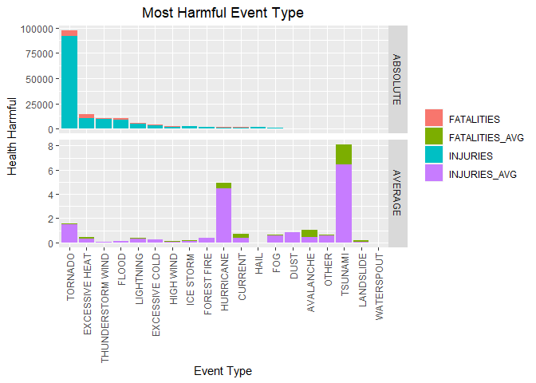
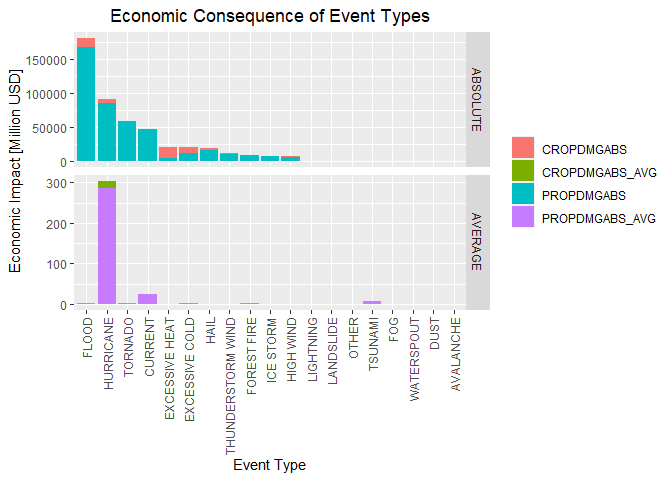

`Course Project 2` Reproducible Research
================

-   👨🏻‍💻 Author: Anderson H Uyekita
-   📚 Specialization: <a
    href="https://www.coursera.org/specializations/data-science-foundations-r"
    target="_blank" rel="noopener">Data Science: Foundations using R
    Specialization</a>
-   📖 Course:
    <a href="https://www.coursera.org/learn/reproducible-research"
    target="_blank" rel="noopener">Reproducible Research</a>
    -   🧑‍🏫 Instructor: Roger D Peng
-   📆 Week 4
    -   🚦 Start: Friday, 24 June 2022
    -   🏁 Finish: Tuesday, 28 June 2022

------------------------------------------------------------------------

## Impact of Weather Events on Public Health and Economics

[](https://mybinder.org/v2/gh/AndersonUyekita/reproducible-research_course-project-2/master?urlpath=rstudio)

### Synopsis

According to the analysis performed to answer questions 1 and 2, the
event type with the most harmful consequences is the `TORNADO` due to
its high frequency and high average number of injuries and fatalities.
On the other hand, `HURRICANE` and `TSUNAMI` do not have the highest
number of harmful to the person. Also, both have a low probability of
happening. From the given dataset, we have recorded 299 hurricanes and
20 tsunamis. On the other hand, there are more than 60 thousand
tornadoes observations. Still, the average number of deaths and injuries
is greater than the `TORNADO`, which we could interpret as both event
types being more deadly.

Lastly, `FLOOD` is the event type with the most significant economic
impact in absolute values, which reach more than USD 180 billion (most
of it is related to Properties Damages). On the other hand, weather
problems such as `EXCESSIVE HEAT` and `EXCESSIVE COLD`c also
significantly impact economic affairs. For example, the `EXCESSIVE HEAT`
has generated more than USD 15.8 billion in Damages to Crops. Another
critical point is HURRICANE does not happen regularly. Still, when it
happens, it causes severe Damage to Properties and Crops. Based on the
given dataset, hurricanes average generate USD 300 million of Damage for
each event.

------------------------------------------------------------------------

## 1. Introduction

Course Project 2 explores the database from [U.S. National Oceanic and
Atmospheric Administration](s_1) (NOAA) and will be used to create a
Reproducible Research following the instructions and reviews criteria
stated by the Course instructor. This reproducible research should be
hosted on
[Rpubs](https://rpubs.com/AndersonUyekita/course-project-2_reproducible-research)
and will be evaluated in a peer-graded assignment. In addition, Course
Project 2 also aims to evaluate the economic impacts and the
consequences caused by storms, hurricanes, tornadoes, floods, and other
environmental disasters.

## 2. Objectivies <a href="" id="objectivies"></a>

The objective of Course Project 2 aims to answer two questions:

1.  Across the United States, which types of events (as indicated in the
    `EVTYPE` variable) are most harmful with respect to population
    health?
2.  Across the United States, which types of events have the greatest
    economic consequences?

The publication will present the answers to Course Project 2 questions
in section 7. Results.

## 3. Requirements and Settings

Requirements necessary to reproduce this analysis:

``` r
# Loading libraries
library(ggplot2)
library(tidyverse)
library(rmarkdown)
library(magrittr)
library(kableExtra)
library(DT)
```

Following the Course Project 2 instruction, it is necessary to set
everything up in English.

``` r
# Force the R environment to use English settings
Sys.setlocale("LC_ALL","English")
```

    ## [1] "LC_COLLATE=English_United States.1252;LC_CTYPE=English_United States.1252;LC_MONETARY=English_United States.1252;LC_NUMERIC=C;LC_TIME=English_United States.1252"

Finally, if you want to reproduce it on your computer, I have printed
below the `sessionInfo()`, which will help you to load all packages used
to perform this publication.

    ## R version 4.2.0 (2022-04-22 ucrt)
    ## Platform: x86_64-w64-mingw32/x64 (64-bit)
    ## Running under: Windows 10 x64 (build 22000)
    ## 
    ## Matrix products: default
    ## 
    ## locale:
    ## [1] LC_COLLATE=English_United States.1252 
    ## [2] LC_CTYPE=English_United States.1252   
    ## [3] LC_MONETARY=English_United States.1252
    ## [4] LC_NUMERIC=C                          
    ## [5] LC_TIME=English_United States.1252    
    ## system code page: 65001
    ## 
    ## attached base packages:
    ## [1] stats     graphics  grDevices utils     datasets  methods   base     
    ## 
    ## other attached packages:
    ##  [1] DT_0.23          kableExtra_1.3.4 magrittr_2.0.3   forcats_0.5.1   
    ##  [5] stringr_1.4.0    dplyr_1.0.9      purrr_0.3.4      readr_2.1.2     
    ##  [9] tidyr_1.2.0      tibble_3.1.7     tidyverse_1.3.1  ggplot2_3.3.6   
    ## [13] rmarkdown_2.14  
    ## 
    ## loaded via a namespace (and not attached):
    ##  [1] tidyselect_1.1.2  xfun_0.31         haven_2.5.0       colorspace_2.0-3 
    ##  [5] vctrs_0.4.1       generics_0.1.2    viridisLite_0.4.0 htmltools_0.5.2  
    ##  [9] yaml_2.3.5        utf8_1.2.2        rlang_1.0.2       pillar_1.7.0     
    ## [13] glue_1.6.2        withr_2.5.0       DBI_1.1.3         dbplyr_2.2.0     
    ## [17] modelr_0.1.8      readxl_1.4.0      lifecycle_1.0.1   munsell_0.5.0    
    ## [21] gtable_0.3.0      cellranger_1.1.0  rvest_1.0.2       htmlwidgets_1.5.4
    ## [25] codetools_0.2-18  evaluate_0.15     knitr_1.39.3      tzdb_0.3.0       
    ## [29] fastmap_1.1.0     fansi_1.0.3       broom_0.8.0       scales_1.2.0     
    ## [33] backports_1.4.1   webshot_0.5.3     jsonlite_1.8.0    systemfonts_1.0.4
    ## [37] fs_1.5.2          hms_1.1.1         digest_0.6.29     stringi_1.7.6    
    ## [41] grid_4.2.0        cli_3.3.0         tools_4.2.0       crayon_1.5.1     
    ## [45] pkgconfig_2.0.3   ellipsis_0.3.2    xml2_1.3.3        reprex_2.0.1     
    ## [49] lubridate_1.8.0   svglite_2.1.0     assertthat_0.2.1  httr_1.4.3       
    ## [53] rstudioapi_0.13   R6_2.5.1          compiler_4.2.0

## 4. Data Processing

The data source used for this Course Project is from the [U.S. National
Oceanic and Atmospheric Administration’s (NOAA)](http://www.noaa.gov),
this dataset has recorded data about storms, tornados, floods, and other
environmental and natural disasters between [1950 and
2011](https://d396qusza40orc.cloudfront.net/repdata%2Fdata%2FStormData.csv.bz2).
In addition, the dataset also includes the number of fatalities,
injuries, and property damages.

### 4.1. Downloading

Creating a data folder to store the dataset from NOAA.

``` r
# 1. Create a data directory
if(!base::file.exists("data")) {
    base::dir.create("data")
}

# 2. Download files and store it in data directory.
if(!base::file.exists("./data/repdata_data_StormData.csv.bz2")){
    utils::download.file(url = "https://d396qusza40orc.cloudfront.net/repdata%2Fdata%2FStormData.csv.bz2",
                         destfile = "./data/repdata_data_StormData.csv.bz2")
}
```

### 4.2. Loading

Although the bz2 is a compressed file, the base system function
`read.csv` can read it without uncompressing it.

``` r
# Loading the raw dataset.
raw_data <- utils::read.csv(file = "./data/repdata_data_StormData.csv.bz2")
```

Due to the facility to manage data frames using the `tidyverse` package,
I have converted the `raw_data` object into a tibble class.

``` r
# Convert the regular data frame into a dplyr table
raw_data <- dplyr::tbl_df(raw_data)
```

## 5. Data Assessing

This section presents a few characteristics of the raw dataset, and does
not have the intention of performing an exploratory data analysis.
Instead, it is just a big picture of the raw dataset.

### 5.1. Dimensions

The raw dataset loaded from the bz2 file comprises 902.297 observations
and 37 columns (variables), as it is possible to confirmed by the
`dim()` function.

``` r
# Checking the observations and varibles in raw dataset.
base::dim(raw_data) # [Observations/rows] [variables/columns]
```

    ## [1] 902297     37

### 5.2. Head and Tail

The first 5 lines of the raw data set:

``` r
# Printing the first 5 rows.
head(raw_data,5)
```

    ## # A tibble: 5 x 37
    ##   STATE__ BGN_DATE   BGN_TIME TIME_ZONE COUNTY COUNTYNAME STATE EVTYPE BGN_RANGE
    ##     <dbl> <chr>      <chr>    <chr>      <dbl> <chr>      <chr> <chr>      <dbl>
    ## 1       1 4/18/1950~ 0130     CST           97 MOBILE     AL    TORNA~         0
    ## 2       1 4/18/1950~ 0145     CST            3 BALDWIN    AL    TORNA~         0
    ## 3       1 2/20/1951~ 1600     CST           57 FAYETTE    AL    TORNA~         0
    ## 4       1 6/8/1951 ~ 0900     CST           89 MADISON    AL    TORNA~         0
    ## 5       1 11/15/195~ 1500     CST           43 CULLMAN    AL    TORNA~         0
    ## # ... with 28 more variables: BGN_AZI <chr>, BGN_LOCATI <chr>, END_DATE <chr>,
    ## #   END_TIME <chr>, COUNTY_END <dbl>, COUNTYENDN <lgl>, END_RANGE <dbl>,
    ## #   END_AZI <chr>, END_LOCATI <chr>, LENGTH <dbl>, WIDTH <dbl>, F <int>,
    ## #   MAG <dbl>, FATALITIES <dbl>, INJURIES <dbl>, PROPDMG <dbl>,
    ## #   PROPDMGEXP <chr>, CROPDMG <dbl>, CROPDMGEXP <chr>, WFO <chr>,
    ## #   STATEOFFIC <chr>, ZONENAMES <chr>, LATITUDE <dbl>, LONGITUDE <dbl>,
    ## #   LATITUDE_E <dbl>, LONGITUDE_ <dbl>, REMARKS <chr>, REFNUM <dbl>

The last 5 lines of the raw data set:

``` r
# Printing the last 5 rows.
tail(raw_data,5)
```

    ## # A tibble: 5 x 37
    ##   STATE__ BGN_DATE   BGN_TIME TIME_ZONE COUNTY COUNTYNAME STATE EVTYPE BGN_RANGE
    ##     <dbl> <chr>      <chr>    <chr>      <dbl> <chr>      <chr> <chr>      <dbl>
    ## 1      56 11/30/201~ 10:30:0~ MST            7 WYZ007 - ~ WY    HIGH ~         0
    ## 2      30 11/10/201~ 02:48:0~ MST            9 MTZ009 - ~ MT    HIGH ~         0
    ## 3       2 11/8/2011~ 02:58:0~ AKS          213 AKZ213     AK    HIGH ~         0
    ## 4       2 11/9/2011~ 10:21:0~ AKS          202 AKZ202     AK    BLIZZ~         0
    ## 5       1 11/28/201~ 08:00:0~ CST            6 ALZ006     AL    HEAVY~         0
    ## # ... with 28 more variables: BGN_AZI <chr>, BGN_LOCATI <chr>, END_DATE <chr>,
    ## #   END_TIME <chr>, COUNTY_END <dbl>, COUNTYENDN <lgl>, END_RANGE <dbl>,
    ## #   END_AZI <chr>, END_LOCATI <chr>, LENGTH <dbl>, WIDTH <dbl>, F <int>,
    ## #   MAG <dbl>, FATALITIES <dbl>, INJURIES <dbl>, PROPDMG <dbl>,
    ## #   PROPDMGEXP <chr>, CROPDMG <dbl>, CROPDMGEXP <chr>, WFO <chr>,
    ## #   STATEOFFIC <chr>, ZONENAMES <chr>, LATITUDE <dbl>, LONGITUDE <dbl>,
    ## #   LATITUDE_E <dbl>, LONGITUDE_ <dbl>, REMARKS <chr>, REFNUM <dbl>

### 5.3. Variables

The dataset from NOAA has 37 variables, as seen from the `str` function.

``` r
# Printing the variables' names.
utils::str(raw_data)
```

    ## tibble [902,297 x 37] (S3: tbl_df/tbl/data.frame)
    ##  $ STATE__   : num [1:902297] 1 1 1 1 1 1 1 1 1 1 ...
    ##  $ BGN_DATE  : chr [1:902297] "4/18/1950 0:00:00" "4/18/1950 0:00:00" "2/20/1951 0:00:00" "6/8/1951 0:00:00" ...
    ##  $ BGN_TIME  : chr [1:902297] "0130" "0145" "1600" "0900" ...
    ##  $ TIME_ZONE : chr [1:902297] "CST" "CST" "CST" "CST" ...
    ##  $ COUNTY    : num [1:902297] 97 3 57 89 43 77 9 123 125 57 ...
    ##  $ COUNTYNAME: chr [1:902297] "MOBILE" "BALDWIN" "FAYETTE" "MADISON" ...
    ##  $ STATE     : chr [1:902297] "AL" "AL" "AL" "AL" ...
    ##  $ EVTYPE    : chr [1:902297] "TORNADO" "TORNADO" "TORNADO" "TORNADO" ...
    ##  $ BGN_RANGE : num [1:902297] 0 0 0 0 0 0 0 0 0 0 ...
    ##  $ BGN_AZI   : chr [1:902297] "" "" "" "" ...
    ##  $ BGN_LOCATI: chr [1:902297] "" "" "" "" ...
    ##  $ END_DATE  : chr [1:902297] "" "" "" "" ...
    ##  $ END_TIME  : chr [1:902297] "" "" "" "" ...
    ##  $ COUNTY_END: num [1:902297] 0 0 0 0 0 0 0 0 0 0 ...
    ##  $ COUNTYENDN: logi [1:902297] NA NA NA NA NA NA ...
    ##  $ END_RANGE : num [1:902297] 0 0 0 0 0 0 0 0 0 0 ...
    ##  $ END_AZI   : chr [1:902297] "" "" "" "" ...
    ##  $ END_LOCATI: chr [1:902297] "" "" "" "" ...
    ##  $ LENGTH    : num [1:902297] 14 2 0.1 0 0 1.5 1.5 0 3.3 2.3 ...
    ##  $ WIDTH     : num [1:902297] 100 150 123 100 150 177 33 33 100 100 ...
    ##  $ F         : int [1:902297] 3 2 2 2 2 2 2 1 3 3 ...
    ##  $ MAG       : num [1:902297] 0 0 0 0 0 0 0 0 0 0 ...
    ##  $ FATALITIES: num [1:902297] 0 0 0 0 0 0 0 0 1 0 ...
    ##  $ INJURIES  : num [1:902297] 15 0 2 2 2 6 1 0 14 0 ...
    ##  $ PROPDMG   : num [1:902297] 25 2.5 25 2.5 2.5 2.5 2.5 2.5 25 25 ...
    ##  $ PROPDMGEXP: chr [1:902297] "K" "K" "K" "K" ...
    ##  $ CROPDMG   : num [1:902297] 0 0 0 0 0 0 0 0 0 0 ...
    ##  $ CROPDMGEXP: chr [1:902297] "" "" "" "" ...
    ##  $ WFO       : chr [1:902297] "" "" "" "" ...
    ##  $ STATEOFFIC: chr [1:902297] "" "" "" "" ...
    ##  $ ZONENAMES : chr [1:902297] "" "" "" "" ...
    ##  $ LATITUDE  : num [1:902297] 3040 3042 3340 3458 3412 ...
    ##  $ LONGITUDE : num [1:902297] 8812 8755 8742 8626 8642 ...
    ##  $ LATITUDE_E: num [1:902297] 3051 0 0 0 0 ...
    ##  $ LONGITUDE_: num [1:902297] 8806 0 0 0 0 ...
    ##  $ REMARKS   : chr [1:902297] "" "" "" "" ...
    ##  $ REFNUM    : num [1:902297] 1 2 3 4 5 6 7 8 9 10 ...

The `read.csv()` function did not correctly import the following
variables:

-   `BGN_DATE`, `END_DATE`, `BGN_TIME` and `END_TIME` are `Date` class
    variables;

### 5.3. `NA` Presence

The variables LATITUDE and LATITUDE_E have the presence of `NA`
observations.

``` r
# Printing the summary of LATITUDE.
summary(raw_data$LATITUDE)
```

    ##    Min. 1st Qu.  Median    Mean 3rd Qu.    Max.    NA's 
    ##       0    2802    3540    2875    4019    9706      47

``` r
# Printing the summary of LATITUDE_E.
summary(raw_data$LATITUDE_E)
```

    ##    Min. 1st Qu.  Median    Mean 3rd Qu.    Max.    NA's 
    ##       0       0       0    1452    3549    9706      40

All those `NA` observations are related to the `AMERICAN SAMOA`
territory.

``` r
# Filtering the NA observations and finding the origins.
raw_data %>% 
    filter(is.na(LATITUDE) | is.na(LATITUDE_E)) %>% 
    select(STATEOFFIC) %>%
    unique()
```

    ## # A tibble: 1 x 1
    ##   STATEOFFIC    
    ##   <chr>         
    ## 1 AMERICAN SAMOA

### 5.4. Exponential Variable

The `PROPDMGEXP` and `CROPDMGEXP` (Properties Exponential and Crop
Exponential) variables store the base 10 exponential value of `PROPDMG`
and `CROPDMG`, respectively. For this reason, it is necessary to combine
`PROPDMG` and `PROPDMGEXP` into a single variable and do the same to
`CROPDMG` and `CROPDMGEXP`.

**Example**

    [PROPDMG] * 10^[PROPDMGEXP]

    1.5 * 10^[B] = 1.5 billion USD

Therefore, it is essential to understand how the `PROPDMGEXP` and
`CROPDMGEXP` were recorded.

``` r
# Printing the unique values to exponential to Properties.
unique(raw_data$PROPDMGEXP)
```

    ##  [1] "K" "M" ""  "B" "m" "+" "0" "5" "6" "?" "4" "2" "3" "h" "7" "H" "-" "1" "8"

``` r
# Printing the unique values to exponential to Crops.
unique(raw_data$CROPDMGEXP)
```

    ## [1] ""  "M" "K" "m" "B" "?" "0" "k" "2"

Finally, the notation is not uniform because sometimes they use Capital
or Lowercase (e.g., `K` or `k`). In other cases, they use a number or
insert a question mark (`?`) or plus/minus signal (e.g., `-` or `+`).

-   `PROPDMGEXP`
    -   `?`: Has 8 (eight) observations with this notation, none of the
        rows of `PROPDM` and `CROPDMG` has values;
    -   `+`: Has 5 (five) observations with this notation, and;
    -   `-`: Has 1 (one) observation with this notation and 1 (one)
        fatality. I will consider like “0”.
-   `CROPDMGEXP`
    -   `?`: Has 7 (seven) observations with this notation, all those
        with `CROPDMG` as zero;

### 5.5. Event Type

The raw dataset has 985 Event Types, the code below will present the
first 10.

``` r
raw_data %>%
    group_by(EVTYPE) %>%
    summarise(n = n()) %>%
    arrange(desc(n)) %>%
    head(10)
```

    ## # A tibble: 10 x 2
    ##    EVTYPE                  n
    ##    <chr>               <int>
    ##  1 HAIL               288661
    ##  2 TSTM WIND          219940
    ##  3 THUNDERSTORM WIND   82563
    ##  4 TORNADO             60652
    ##  5 FLASH FLOOD         54277
    ##  6 FLOOD               25326
    ##  7 THUNDERSTORM WINDS  20843
    ##  8 HIGH WIND           20212
    ##  9 LIGHTNING           15754
    ## 10 HEAVY SNOW          15708

Unfortunately, there is no standardization, as seen in `TSTM WIND,`
`THUNDERSTORM WIND,` and `THUNDERSTORM WINDS.` For this reason, it is
necessary to adjust this variable, consolidating those events using a
single notation.

For further understanding of each variable, please visit the
[codebook](https://github.com/AndersonUyekita/reproducible-research_course-project-2/blob/master/codebook.md).

## 6. Data Manipulation

Although I have observed problems in `BGN_DATE`, `END_DATE`, `BGN_TIME`
and `END_TIME` for this Course Project 2, those variables will be not
used for further analysis. For this reason, I will subset the raw
dataset to work with part of it.

### 6.1. Subsetting the raw data

Based on the questions posted on 2. Objectivies, they are related to the
most harmful concerning population health and its economic consequences.
Thus, the raw dataset subset will select the following variables:

-   `EVTYPE`: Event type;
-   `INJURIES`: Quantity of injuries;
-   `FATALITIES`: Quantity of fatalities;
-   `PROPDMG`: Amount in USD in Damages in properties;
-   `CROPDMG`: Amount in USD in Damages in crops;
-   `PROPDMGEXP`: The exponential in base 10 used to notate the PROPDMG,
    and;
-   `CROPDMGEXP`: The exponential in base 10 used to notate the CROPDMG.

``` r
# Subsetting the raw dataset.
df_subset <- select(raw_data,EVTYPE,INJURIES,FATALITIES,PROPDMG,PROPDMGEXP,CROPDMG,CROPDMGEXP)
```

### 6.2. Merging Damage and Exponential Variables

It is necessary to merge `PROPDMG` and `PROPDMGEXP` into a single
variable, so I will create the `PROPDMGABS` using the following rules.

-   All `0`, `` and `-` will be converted into 1;
-   All `1` will be converted into 10;
-   All `H`, `h` and `2` will be converted into 100;
-   All `K`, `k` and `3` will be converted into 1000;
-   All `4` will be converted into 10000;
-   All `5` will be converted into 100000;
-   All `M`, `m` and `6` will be converted into 1000000;
-   All `7` will be converted into 10000000;
-   All `8` will be converted into 100000000;
-   All `B`, `b` and `9` will be converted into 1000000000;

Following the same principles, I will merge `CROPDMG` and `CROPDMG` to
create `CROPDMGABS`:

-   All `0`, `` and `?` will be converted into 1;
-   All `H`, `h` and `2` will be converted into 100;
-   All `K`, `k` and `3` will be converted into 1000;
-   All `M`, `m` and `6` will be converted into 1000000;
-   All `B`, `b` and `9` will be converted into 1000000000;

The `PROPDMGABS` and `CROPDMGABS` will be in charge of storing the
absolute values of Properties Damages and Crops Damages.

``` r
# Merging exponential column and value column.
df_subset_2 <- df_subset %>%
    
    # Creating a new column PROPDMGABS
    mutate(PROPDMGABS = case_when(
        PROPDMGEXP %in% c("", "-",0) ~ PROPDMG * 1,
        PROPDMGEXP %in% c(1)         ~ PROPDMG * 10,
        PROPDMGEXP %in% c("H","h",2) ~ PROPDMG * 100,
        PROPDMGEXP %in% c("K","k",3) ~ PROPDMG * 1000,
        PROPDMGEXP %in% c(4)         ~ PROPDMG * 10000,
        PROPDMGEXP %in% c(5)         ~ PROPDMG * 100000,
        PROPDMGEXP %in% c("M","m",6) ~ PROPDMG * 1000000,
        PROPDMGEXP %in% c(7)         ~ PROPDMG * 10000000,
        PROPDMGEXP %in% c(8)         ~ PROPDMG * 100000000,
        PROPDMGEXP %in% c("B","b",9) ~ PROPDMG * 1000000000)) %>%
    
    # Creating a new column CROPDMGABS
    mutate(CROPDMGABS = case_when(
        CROPDMGEXP %in% c("?","", 0)   ~ CROPDMG * 1,
        CROPDMGEXP %in% c("H", "h", 2) ~ CROPDMG * 100,
        CROPDMGEXP %in% c("K", "k", 3) ~ CROPDMG * 1000,
        CROPDMGEXP %in% c("M", "m", 6) ~ CROPDMG * 1000000,
        CROPDMGEXP %in% c("B", "b", 9) ~ CROPDMG * 1000000000)) 
```

### 6.3. Uniforming Event Types

The EVTYPE variable is not tidy because there are a lot of
classifications with the same meaning but different notations. Hence, I
will standardize this variable following the rules inside of the next
chunk.

``` r
# Standardizing the EVTYPE variable.
df_subset_3 <- df_subset_2 %>%
    
    # Converting all value to be UPPERCASE.
    mutate(EVTYPE = stringr::str_to_upper(EVTYPE)) %>%
    
    # Rules to aggregate events into a new variable called EVTYPE_2
    mutate(EVTYPE_2 = case_when(
        grepl(pattern = "*HURRICANE*|*TYPHOON*", x = EVTYPE) ~ "HURRICANE",
        grepl(pattern = "*TORNADO*", x = EVTYPE) ~ "TORNADO",
        grepl(pattern = "*THUNDERSTORM WIN*|*TSTM*|*FUNNEL CLOUD*|*FUNNEL*|*THUNDERSTORM*", x = EVTYPE) ~ "THUNDERSTORM WIND",
        grepl(pattern = "*FLOOD*|*FLD*", x = EVTYPE) ~ "FLOOD",
        grepl(pattern = "*HAIL*", x = EVTYPE) ~ "HAIL",
        grepl(pattern = "*HIGH WIND*|*STRONG WIND*|WIND", x = EVTYPE) ~ "HIGH WIND",
        grepl(pattern = "*FOREST FIRE*|*WILD FIRES*|*WILDFIRE*", x = EVTYPE) ~ "FOREST FIRE",
        grepl(pattern = "*LIGHTNING*", x = EVTYPE) ~ "LIGHTNING",
        grepl(pattern = "*HEAT*|*DROUGHT*|*EXCESSIVE HEAT*|*RECORD HIGH*|*WARMTH*|*UNSEASONABLY WARM*|*UNSEASONABLY DRY*|*TEMPERATURE RECORD*|*RECORD TEMPERATURE*|*DRY*", x = EVTYPE) ~ "EXCESSIVE HEAT",
        grepl(pattern = "*WINTER WEATHER*|*FROST/FREEZE*|*EXTREME COLD*|*COLD*|*ICE*|*FREEZE*|*FROST*|*WINTRY MIX*|*LOW TEMPERATURE*", x = EVTYPE) ~ "EXCESSIVE COLD",
        grepl(pattern = "*WINTER STORM*|*SLEET*|*SNOW*|*BLIZZARD*|*FREEZING RAIN*", x = EVTYPE) ~ "ICE STORM",
        grepl(pattern = "*LANDSLIDE*|*MUDSLIDE*|*MUD SLIDE*", x = EVTYPE) ~ "LANDSLIDE",
        grepl(pattern = "*AVALANCHE*", x = EVTYPE) ~ "AVALANCHE",
        grepl(pattern = "*FOG*|*SMOKE*", x = EVTYPE) ~ "FOG",
        grepl(pattern = "*DUST*", x = EVTYPE) ~ "DUST",
        grepl(pattern = "*CURRENT*|*SURF*", x = EVTYPE) ~ "CURRENT",
        grepl(pattern = "*TSUNAMI*", x = EVTYPE) ~ "TSUNAMI",
        grepl(pattern = "*WATERSPOUT*", x = EVTYPE) ~ "WATERSPOUT")) %>%
    
    # Creating a OTHER type of event to aggregate minor events.
    mutate(EVTYPE_2 = case_when(
        is.na(EVTYPE_2) ~ "OTHER",
        !is.na(EVTYPE_2) ~ EVTYPE_2)) %>%
    
    # Dropping EVTYPE because it is not necessary to carry it.
    select(-EVTYPE) %>%
    
    # Renaming the EVTYPE_2 to be the new EVTYPE
    mutate(EVTYPE = EVTYPE_2)
```

After the standardization, the new `EVTYPE` has 19 categories.

``` r
# Printing the standards of Event Type
unique(df_subset_3$EVTYPE)
```

    ##  [1] "TORNADO"           "THUNDERSTORM WIND" "HAIL"             
    ##  [4] "EXCESSIVE COLD"    "ICE STORM"         "FLOOD"            
    ##  [7] "HURRICANE"         "EXCESSIVE HEAT"    "LIGHTNING"        
    ## [10] "FOG"               "CURRENT"           "HIGH WIND"        
    ## [13] "OTHER"             "WATERSPOUT"        "AVALANCHE"        
    ## [16] "DUST"              "FOREST FIRE"       "LANDSLIDE"        
    ## [19] "TSUNAMI"

### 6.3. Tidy dataset

The tidy dataset will be composite by the `EVTYPE`, `INJURIES`,
`FATALITIES`, `PROPDMGABS` and `CROPDMGABS`.

``` r
# Creating the tidy dataset.
df_tidy <- df_subset_3 %>%
    
    # Dropping the columns: PROPDMGEXP, PROPDMG, CROPDMGEXP, CROPDMG
    select(-c(PROPDMGEXP, PROPDMG, CROPDMGEXP, CROPDMG))
```

## 7. Results <a href="" id="results"></a>

#### Question 1

> Across the United States, which types of events (as indicated in the
> EVTYPE variable) are most harmful with respect to population health?

**Answer**

I will define **harmful** as the summation of `INJURIES` and
`FATALITIES` of each `EVTYPE`. Therefore, it is necessary to create a
new variable, the so-called `HARMFUL`, to store these aggregation. I
also will create 3 new variables to store the average of injuries
(`INJURIES_AVG`), fatalities (`FATALITIES_AVG`), and harmful
(`HARMFUL_AVG`) based on the number of observations (`QTY`) of each
`EVTYPE`.

``` r
# This subset will creates averages of each EVTYPE and add the Harmful variable.
df_tidy_q1 <- df_tidy %>%
    
    # Creating the HARMFUL variable.
    mutate(HARMFUL = INJURIES + FATALITIES) %>%
    
    # Aggregate everything using EVTYPE.
    group_by(EVTYPE) %>%
    
    # Summarizes the data using the group by EVTYPE.
    summarise(HARMFUL = sum(HARMFUL),
              QTY = n(),
              FATALITIES = sum(FATALITIES),
              INJURIES = sum(INJURIES)) %>%
    
    # Arrange to be descendant.
    arrange(desc(HARMFUL)) %>%
    
    # Adding averages variables.
    mutate(HARMFUL_AVG = HARMFUL/QTY,
           FATALITIES_AVG = FATALITIES/QTY,
           INJURIES_AVG = INJURIES/QTY)
```

The adjusted dataset will be shown below.

``` r
# Printing the 
head(df_tidy_q1, 19) %>% kableExtra::kbl() %>% kableExtra::kable_styling()
```

<table class="table" style="margin-left: auto; margin-right: auto;">
<thead>
<tr>
<th style="text-align:left;">
EVTYPE
</th>
<th style="text-align:right;">
HARMFUL
</th>
<th style="text-align:right;">
QTY
</th>
<th style="text-align:right;">
FATALITIES
</th>
<th style="text-align:right;">
INJURIES
</th>
<th style="text-align:right;">
HARMFUL_AVG
</th>
<th style="text-align:right;">
FATALITIES_AVG
</th>
<th style="text-align:right;">
INJURIES_AVG
</th>
</tr>
</thead>
<tbody>
<tr>
<td style="text-align:left;">
TORNADO
</td>
<td style="text-align:right;">
97068
</td>
<td style="text-align:right;">
60700
</td>
<td style="text-align:right;">
5661
</td>
<td style="text-align:right;">
91407
</td>
<td style="text-align:right;">
1.5991433
</td>
<td style="text-align:right;">
0.0932619
</td>
<td style="text-align:right;">
1.5058814
</td>
</tr>
<tr>
<td style="text-align:left;">
EXCESSIVE HEAT
</td>
<td style="text-align:right;">
14132
</td>
<td style="text-align:right;">
33788
</td>
<td style="text-align:right;">
3467
</td>
<td style="text-align:right;">
10665
</td>
<td style="text-align:right;">
0.4182550
</td>
<td style="text-align:right;">
0.1026104
</td>
<td style="text-align:right;">
0.3156446
</td>
</tr>
<tr>
<td style="text-align:left;">
THUNDERSTORM WIND
</td>
<td style="text-align:right;">
10276
</td>
<td style="text-align:right;">
343796
</td>
<td style="text-align:right;">
729
</td>
<td style="text-align:right;">
9547
</td>
<td style="text-align:right;">
0.0298898
</td>
<td style="text-align:right;">
0.0021204
</td>
<td style="text-align:right;">
0.0277694
</td>
</tr>
<tr>
<td style="text-align:left;">
FLOOD
</td>
<td style="text-align:right;">
10236
</td>
<td style="text-align:right;">
86133
</td>
<td style="text-align:right;">
1553
</td>
<td style="text-align:right;">
8683
</td>
<td style="text-align:right;">
0.1188395
</td>
<td style="text-align:right;">
0.0180303
</td>
<td style="text-align:right;">
0.1008092
</td>
</tr>
<tr>
<td style="text-align:left;">
LIGHTNING
</td>
<td style="text-align:right;">
6048
</td>
<td style="text-align:right;">
15763
</td>
<td style="text-align:right;">
817
</td>
<td style="text-align:right;">
5231
</td>
<td style="text-align:right;">
0.3836833
</td>
<td style="text-align:right;">
0.0518302
</td>
<td style="text-align:right;">
0.3318531
</td>
</tr>
<tr>
<td style="text-align:left;">
EXCESSIVE COLD
</td>
<td style="text-align:right;">
3972
</td>
<td style="text-align:right;">
14341
</td>
<td style="text-align:right;">
483
</td>
<td style="text-align:right;">
3489
</td>
<td style="text-align:right;">
0.2769681
</td>
<td style="text-align:right;">
0.0336797
</td>
<td style="text-align:right;">
0.2432885
</td>
</tr>
<tr>
<td style="text-align:left;">
HIGH WIND
</td>
<td style="text-align:right;">
2690
</td>
<td style="text-align:right;">
28173
</td>
<td style="text-align:right;">
696
</td>
<td style="text-align:right;">
1994
</td>
<td style="text-align:right;">
0.0954815
</td>
<td style="text-align:right;">
0.0247045
</td>
<td style="text-align:right;">
0.0707770
</td>
</tr>
<tr>
<td style="text-align:left;">
ICE STORM
</td>
<td style="text-align:right;">
2565
</td>
<td style="text-align:right;">
15973
</td>
<td style="text-align:right;">
335
</td>
<td style="text-align:right;">
2230
</td>
<td style="text-align:right;">
0.1605835
</td>
<td style="text-align:right;">
0.0209729
</td>
<td style="text-align:right;">
0.1396106
</td>
</tr>
<tr>
<td style="text-align:left;">
FOREST FIRE
</td>
<td style="text-align:right;">
1696
</td>
<td style="text-align:right;">
4232
</td>
<td style="text-align:right;">
90
</td>
<td style="text-align:right;">
1606
</td>
<td style="text-align:right;">
0.4007561
</td>
<td style="text-align:right;">
0.0212665
</td>
<td style="text-align:right;">
0.3794896
</td>
</tr>
<tr>
<td style="text-align:left;">
HURRICANE
</td>
<td style="text-align:right;">
1468
</td>
<td style="text-align:right;">
299
</td>
<td style="text-align:right;">
135
</td>
<td style="text-align:right;">
1333
</td>
<td style="text-align:right;">
4.9096990
</td>
<td style="text-align:right;">
0.4515050
</td>
<td style="text-align:right;">
4.4581940
</td>
</tr>
<tr>
<td style="text-align:left;">
CURRENT
</td>
<td style="text-align:right;">
1442
</td>
<td style="text-align:right;">
1937
</td>
<td style="text-align:right;">
712
</td>
<td style="text-align:right;">
730
</td>
<td style="text-align:right;">
0.7444502
</td>
<td style="text-align:right;">
0.3675787
</td>
<td style="text-align:right;">
0.3768715
</td>
</tr>
<tr>
<td style="text-align:left;">
HAIL
</td>
<td style="text-align:right;">
1386
</td>
<td style="text-align:right;">
289281
</td>
<td style="text-align:right;">
15
</td>
<td style="text-align:right;">
1371
</td>
<td style="text-align:right;">
0.0047912
</td>
<td style="text-align:right;">
0.0000519
</td>
<td style="text-align:right;">
0.0047393
</td>
</tr>
<tr>
<td style="text-align:left;">
FOG
</td>
<td style="text-align:right;">
1156
</td>
<td style="text-align:right;">
1855
</td>
<td style="text-align:right;">
80
</td>
<td style="text-align:right;">
1076
</td>
<td style="text-align:right;">
0.6231806
</td>
<td style="text-align:right;">
0.0431267
</td>
<td style="text-align:right;">
0.5800539
</td>
</tr>
<tr>
<td style="text-align:left;">
DUST
</td>
<td style="text-align:right;">
507
</td>
<td style="text-align:right;">
586
</td>
<td style="text-align:right;">
24
</td>
<td style="text-align:right;">
483
</td>
<td style="text-align:right;">
0.8651877
</td>
<td style="text-align:right;">
0.0409556
</td>
<td style="text-align:right;">
0.8242321
</td>
</tr>
<tr>
<td style="text-align:left;">
AVALANCHE
</td>
<td style="text-align:right;">
394
</td>
<td style="text-align:right;">
386
</td>
<td style="text-align:right;">
224
</td>
<td style="text-align:right;">
170
</td>
<td style="text-align:right;">
1.0207254
</td>
<td style="text-align:right;">
0.5803109
</td>
<td style="text-align:right;">
0.4404145
</td>
</tr>
<tr>
<td style="text-align:left;">
OTHER
</td>
<td style="text-align:right;">
344
</td>
<td style="text-align:right;">
546
</td>
<td style="text-align:right;">
44
</td>
<td style="text-align:right;">
300
</td>
<td style="text-align:right;">
0.6300366
</td>
<td style="text-align:right;">
0.0805861
</td>
<td style="text-align:right;">
0.5494505
</td>
</tr>
<tr>
<td style="text-align:left;">
TSUNAMI
</td>
<td style="text-align:right;">
162
</td>
<td style="text-align:right;">
20
</td>
<td style="text-align:right;">
33
</td>
<td style="text-align:right;">
129
</td>
<td style="text-align:right;">
8.1000000
</td>
<td style="text-align:right;">
1.6500000
</td>
<td style="text-align:right;">
6.4500000
</td>
</tr>
<tr>
<td style="text-align:left;">
LANDSLIDE
</td>
<td style="text-align:right;">
99
</td>
<td style="text-align:right;">
643
</td>
<td style="text-align:right;">
44
</td>
<td style="text-align:right;">
55
</td>
<td style="text-align:right;">
0.1539658
</td>
<td style="text-align:right;">
0.0684292
</td>
<td style="text-align:right;">
0.0855365
</td>
</tr>
<tr>
<td style="text-align:left;">
WATERSPOUT
</td>
<td style="text-align:right;">
32
</td>
<td style="text-align:right;">
3845
</td>
<td style="text-align:right;">
3
</td>
<td style="text-align:right;">
29
</td>
<td style="text-align:right;">
0.0083225
</td>
<td style="text-align:right;">
0.0007802
</td>
<td style="text-align:right;">
0.0075423
</td>
</tr>
</tbody>
</table>

Based on the `df_tidy_q1`, let’s visualize it in a graph.

``` r
# Creating a auxiliary dataset to plot 1.
# It will be necessary to put the dataset in such a way to be helpful to ggplot2.
rbind(
    
    # Gathering the dataset to have absolute data in rows.
    df_tidy_q1 %>%
    select(EVTYPE, FATALITIES, INJURIES) %>%
    mutate(EVTYPE = factor(EVTYPE, levels = EVTYPE)) %>%
    pivot_longer(cols = 2:3, names_to = "HARMFUL", values_to = "VALUES") %>%
    mutate(VALUE_TYPE = factor("ABSOLUTE")),
    
    # Gathering the dataset to average have average data in rows.
    df_tidy_q1 %>%
    arrange(desc(HARMFUL_AVG)) %>%
    select(EVTYPE, FATALITIES_AVG, INJURIES_AVG) %>%
    mutate(EVTYPE = factor(EVTYPE, levels = EVTYPE)) %>%
    pivot_longer(cols = 2:3, names_to = "HARMFUL", values_to = "VALUES")%>%
    mutate(VALUE_TYPE = factor("AVERAGE"))) %>%
    
    # Plotting the graph using GGPLOT2
    ggplot(aes(fill = HARMFUL, y = VALUES, x = EVTYPE)) + 
    
    # Defining a stacked barplot.
    geom_bar(position = "stack", stat = "identity") +
    
    # Defining the graph title.
    ggplot2::labs(title = "Most Harmful Event Type") + 
    
    # Defining the x-axis label
    ggplot2::xlab("Event Type") +
    
    # Defining the y-axis label
    ggplot2::ylab("Health Harmful") +
    
    # Adjusting the x-axis to be 90 degrees.
    theme(axis.text.x = element_text(angle = 90, vjust = 0.5, hjust=1),
          legend.position = "right",
          plot.title = element_text(hjust = 0.5),
          plot.subtitle = element_text(hjust = 0.5)) +
    
    # Removing the legend title.
        ggplot2::guides(fill = ggplot2::guide_legend(title = "")) + 
    
    # Creating facet to show absolute and average values.
    facet_grid(rows = vars(VALUE_TYPE), scales = "free")
```

<!-- -->

In term of **absolute value**, there are no doubt that `TORNADO` events
are the most harmful to health due to the high frequency of tornadoes.
The number of tornadoes observed in the dataset is more than 60 thousand
(between 1950 and 2011), which results in 5.661 `FATALITIES`, 91.407
`INJURIES`, and 97.068 health `HARMFUL`.

However, whether you analyze it in terms of **average**, in that case,
the `TSUNAMI` event type has the highest averages of INJURIES and
FATALITIES, resulting in increased health HARMFUL. The meaning of seeing
the average is to identify the most deadly event type.

#### Question 2

> Across the United States, which types of events have the greatest
> economic consequences?

**Answer**

Following the same principles used in Question 1, I will define as
**economic consequence** the sum of Properties Damages (`PROPDMGABS`)
and Crop Damages (`CROPDMGABS`). Also, I will compare the average of
`PROPDMGABS` and `CROPDMGABS` to analyze which one has the higher
economic impact.

``` r
# This subset will creates averages of each EVTYPE and add the Harmful variable.
df_tidy_q2 <- df_tidy %>%
    
    # Creating the HARMFUL variable.
    mutate(EXPENSES = PROPDMGABS + CROPDMGABS) %>%
    
    # Aggregate everything using EVTYPE.
    group_by(EVTYPE) %>%
    
    # Summarizes the data using the group by EVTYPE.
    summarise(EXPENSES = sum(EXPENSES, na.rm = TRUE),
              QTY = n(),
              PROPDMGABS = sum(PROPDMGABS, na.rm = TRUE),
              CROPDMGABS = sum(CROPDMGABS, na.rm = TRUE)) %>%
    
    # Arrange to be descendant.
    arrange(desc(EXPENSES)) %>%
    
    # Adding averages variables.
    mutate(EXPENSES_AVG = EXPENSES/QTY,
           PROPDMGABS_AVG = PROPDMGABS/QTY,
           CROPDMGABS_AVG = CROPDMGABS/QTY) 
```

The adjusted dataset will be shown below.

``` r
# Printing the 
head(df_tidy_q2, 19) %>% kableExtra::kbl() %>% kableExtra::kable_styling()
```

<table class="table" style="margin-left: auto; margin-right: auto;">
<thead>
<tr>
<th style="text-align:left;">
EVTYPE
</th>
<th style="text-align:right;">
EXPENSES
</th>
<th style="text-align:right;">
QTY
</th>
<th style="text-align:right;">
PROPDMGABS
</th>
<th style="text-align:right;">
CROPDMGABS
</th>
<th style="text-align:right;">
EXPENSES_AVG
</th>
<th style="text-align:right;">
PROPDMGABS_AVG
</th>
<th style="text-align:right;">
CROPDMGABS_AVG
</th>
</tr>
</thead>
<tbody>
<tr>
<td style="text-align:left;">
FLOOD
</td>
<td style="text-align:right;">
180658667663
</td>
<td style="text-align:right;">
86133
</td>
<td style="text-align:right;">
168270100463
</td>
<td style="text-align:right;">
12388567200
</td>
<td style="text-align:right;">
2.097438e+06
</td>
<td style="text-align:right;">
1.953608e+06
</td>
<td style="text-align:right;">
1.438307e+05
</td>
</tr>
<tr>
<td style="text-align:left;">
HURRICANE
</td>
<td style="text-align:right;">
90872527810
</td>
<td style="text-align:right;">
299
</td>
<td style="text-align:right;">
85356410010
</td>
<td style="text-align:right;">
5516117800
</td>
<td style="text-align:right;">
3.039215e+08
</td>
<td style="text-align:right;">
2.854729e+08
</td>
<td style="text-align:right;">
1.844855e+07
</td>
</tr>
<tr>
<td style="text-align:left;">
TORNADO
</td>
<td style="text-align:right;">
59020779387
</td>
<td style="text-align:right;">
60700
</td>
<td style="text-align:right;">
58603317867
</td>
<td style="text-align:right;">
417461520
</td>
<td style="text-align:right;">
9.723357e+05
</td>
<td style="text-align:right;">
9.654583e+05
</td>
<td style="text-align:right;">
6.877455e+03
</td>
</tr>
<tr>
<td style="text-align:left;">
CURRENT
</td>
<td style="text-align:right;">
48056407000
</td>
<td style="text-align:right;">
1937
</td>
<td style="text-align:right;">
48055552000
</td>
<td style="text-align:right;">
855000
</td>
<td style="text-align:right;">
2.480971e+07
</td>
<td style="text-align:right;">
2.480927e+07
</td>
<td style="text-align:right;">
4.414042e+02
</td>
</tr>
<tr>
<td style="text-align:left;">
EXCESSIVE HEAT
</td>
<td style="text-align:right;">
21065038320
</td>
<td style="text-align:right;">
33788
</td>
<td style="text-align:right;">
5257925140
</td>
<td style="text-align:right;">
15807113180
</td>
<td style="text-align:right;">
6.234473e+05
</td>
<td style="text-align:right;">
1.556152e+05
</td>
<td style="text-align:right;">
4.678322e+05
</td>
</tr>
<tr>
<td style="text-align:left;">
EXCESSIVE COLD
</td>
<td style="text-align:right;">
21015496360
</td>
<td style="text-align:right;">
14341
</td>
<td style="text-align:right;">
11877309560
</td>
<td style="text-align:right;">
9138186800
</td>
<td style="text-align:right;">
1.465414e+06
</td>
<td style="text-align:right;">
8.282065e+05
</td>
<td style="text-align:right;">
6.372071e+05
</td>
</tr>
<tr>
<td style="text-align:left;">
HAIL
</td>
<td style="text-align:right;">
19024452136
</td>
<td style="text-align:right;">
289281
</td>
<td style="text-align:right;">
15977564513
</td>
<td style="text-align:right;">
3046887623
</td>
<td style="text-align:right;">
6.576461e+04
</td>
<td style="text-align:right;">
5.523199e+04
</td>
<td style="text-align:right;">
1.053262e+04
</td>
</tr>
<tr>
<td style="text-align:left;">
THUNDERSTORM WIND
</td>
<td style="text-align:right;">
12456657288
</td>
<td style="text-align:right;">
343796
</td>
<td style="text-align:right;">
11184948300
</td>
<td style="text-align:right;">
1271708988
</td>
<td style="text-align:right;">
3.623270e+04
</td>
<td style="text-align:right;">
3.253368e+04
</td>
<td style="text-align:right;">
3.699022e+03
</td>
</tr>
<tr>
<td style="text-align:left;">
FOREST FIRE
</td>
<td style="text-align:right;">
8899845130
</td>
<td style="text-align:right;">
4232
</td>
<td style="text-align:right;">
8496563500
</td>
<td style="text-align:right;">
403281630
</td>
<td style="text-align:right;">
2.102988e+06
</td>
<td style="text-align:right;">
2.007695e+06
</td>
<td style="text-align:right;">
9.529339e+04
</td>
</tr>
<tr>
<td style="text-align:left;">
ICE STORM
</td>
<td style="text-align:right;">
7551932751
</td>
<td style="text-align:right;">
15973
</td>
<td style="text-align:right;">
7412418751
</td>
<td style="text-align:right;">
139514000
</td>
<td style="text-align:right;">
4.727936e+05
</td>
<td style="text-align:right;">
4.640593e+05
</td>
<td style="text-align:right;">
8.734364e+03
</td>
</tr>
<tr>
<td style="text-align:left;">
HIGH WIND
</td>
<td style="text-align:right;">
7048888488
</td>
<td style="text-align:right;">
28173
</td>
<td style="text-align:right;">
6268408088
</td>
<td style="text-align:right;">
780480400
</td>
<td style="text-align:right;">
2.502001e+05
</td>
<td style="text-align:right;">
2.224970e+05
</td>
<td style="text-align:right;">
2.770313e+04
</td>
</tr>
<tr>
<td style="text-align:left;">
LIGHTNING
</td>
<td style="text-align:right;">
952534520
</td>
<td style="text-align:right;">
15763
</td>
<td style="text-align:right;">
940442430
</td>
<td style="text-align:right;">
12092090
</td>
<td style="text-align:right;">
6.042850e+04
</td>
<td style="text-align:right;">
5.966139e+04
</td>
<td style="text-align:right;">
7.671186e+02
</td>
</tr>
<tr>
<td style="text-align:left;">
LANDSLIDE
</td>
<td style="text-align:right;">
346693100
</td>
<td style="text-align:right;">
643
</td>
<td style="text-align:right;">
326676100
</td>
<td style="text-align:right;">
20017000
</td>
<td style="text-align:right;">
5.391806e+05
</td>
<td style="text-align:right;">
5.080499e+05
</td>
<td style="text-align:right;">
3.113064e+04
</td>
</tr>
<tr>
<td style="text-align:left;">
OTHER
</td>
<td style="text-align:right;">
169455250
</td>
<td style="text-align:right;">
546
</td>
<td style="text-align:right;">
10666300
</td>
<td style="text-align:right;">
158788950
</td>
<td style="text-align:right;">
3.103576e+05
</td>
<td style="text-align:right;">
1.953535e+04
</td>
<td style="text-align:right;">
2.908223e+05
</td>
</tr>
<tr>
<td style="text-align:left;">
TSUNAMI
</td>
<td style="text-align:right;">
144082000
</td>
<td style="text-align:right;">
20
</td>
<td style="text-align:right;">
144062000
</td>
<td style="text-align:right;">
20000
</td>
<td style="text-align:right;">
7.204100e+06
</td>
<td style="text-align:right;">
7.203100e+06
</td>
<td style="text-align:right;">
1.000000e+03
</td>
</tr>
<tr>
<td style="text-align:left;">
FOG
</td>
<td style="text-align:right;">
22929500
</td>
<td style="text-align:right;">
1855
</td>
<td style="text-align:right;">
22929500
</td>
<td style="text-align:right;">
0
</td>
<td style="text-align:right;">
1.236092e+04
</td>
<td style="text-align:right;">
1.236092e+04
</td>
<td style="text-align:right;">
0.000000e+00
</td>
</tr>
<tr>
<td style="text-align:left;">
WATERSPOUT
</td>
<td style="text-align:right;">
9564200
</td>
<td style="text-align:right;">
3845
</td>
<td style="text-align:right;">
9564200
</td>
<td style="text-align:right;">
0
</td>
<td style="text-align:right;">
2.487438e+03
</td>
<td style="text-align:right;">
2.487438e+03
</td>
<td style="text-align:right;">
0.000000e+00
</td>
</tr>
<tr>
<td style="text-align:left;">
DUST
</td>
<td style="text-align:right;">
9388130
</td>
<td style="text-align:right;">
586
</td>
<td style="text-align:right;">
6288130
</td>
<td style="text-align:right;">
3100000
</td>
<td style="text-align:right;">
1.602070e+04
</td>
<td style="text-align:right;">
1.073060e+04
</td>
<td style="text-align:right;">
5.290102e+03
</td>
</tr>
<tr>
<td style="text-align:left;">
AVALANCHE
</td>
<td style="text-align:right;">
3721800
</td>
<td style="text-align:right;">
386
</td>
<td style="text-align:right;">
3721800
</td>
<td style="text-align:right;">
0
</td>
<td style="text-align:right;">
9.641969e+03
</td>
<td style="text-align:right;">
9.641969e+03
</td>
<td style="text-align:right;">
0.000000e+00
</td>
</tr>
</tbody>
</table>

Based on the `df_tidy_q2`, let’s visualize it in a graph.

``` r
# Creating a auxiliary dataset to plot 1.
# It will be necessary to put the dataset in such a way to be helpful to ggplot2.
rbind(
    
    # Gathering the dataset to have absolute data in rows.
    df_tidy_q2 %>%
    select(EVTYPE, PROPDMGABS, CROPDMGABS) %>%
    mutate(EVTYPE = factor(EVTYPE, levels = EVTYPE),
           PROPDMGABS = PROPDMGABS/1000000,
           CROPDMGABS = CROPDMGABS/1000000) %>%
    pivot_longer(cols = 2:3, names_to = "EXPENSES", values_to = "VALUES") %>%
    mutate(VALUE_TYPE = factor("ABSOLUTE")),
    
    # Gathering the dataset to average have average data in rows.
    df_tidy_q2 %>%
    arrange(desc(EXPENSES_AVG)) %>%
    select(EVTYPE, PROPDMGABS_AVG, CROPDMGABS_AVG) %>%
    mutate(EVTYPE = factor(EVTYPE, levels = EVTYPE),
           PROPDMGABS_AVG = PROPDMGABS_AVG/1000000,
           CROPDMGABS_AVG = CROPDMGABS_AVG/1000000) %>%
    pivot_longer(cols = 2:3, names_to = "EXPENSES", values_to = "VALUES")%>%
    mutate(VALUE_TYPE = factor("AVERAGE"))) %>%
    
    # Plotting the graph using GGPLOT2
    ggplot(aes(fill = EXPENSES, y = VALUES, x = EVTYPE)) + 
    
    # Defining a stacked barplot.
    geom_bar(position = "stack", stat = "identity") +
    
    # Defining the graph title.
    ggplot2::labs(title = "Economic Consequence of Event Types") + 
    
    # Defining the x-axis label
    ggplot2::xlab("Event Type") +
    
    # Defining the y-axis label
    ggplot2::ylab("Economic Impact [Million USD]") +
    
    # Adjusting the x-axis to be 90 degrees.
    theme(axis.text.x = element_text(angle = 90, vjust = 0.5, hjust=1),
          legend.position = "right",
          plot.title = element_text(hjust = 0.5),
          plot.subtitle = element_text(hjust = 0.5)) +
    
    # Removing the legend title.
        ggplot2::guides(fill = ggplot2::guide_legend(title = "")) + 
    
    # Creating facet to show absolute and average values.
    facet_grid(rows = vars(VALUE_TYPE), scales = "free")
```

<!-- -->

`FLOOD` is the event with the greatest economic consequence (most of it
related to Properties Damages). Between 1950 and 2011, it causes Damages
to Properties and Crops that reach more than USD 180 billion. However,
the `HURRICANE` is one event type with the highest average in terms of
damage. On average, one hurricane’s outcome is around USD 300 million in
damages.

Finally, it is also important to point out that `EXCESSIVE HEAT` is the
worst event related to Crops, which is almost USD 15.8 billion in
Damages to Crops.
