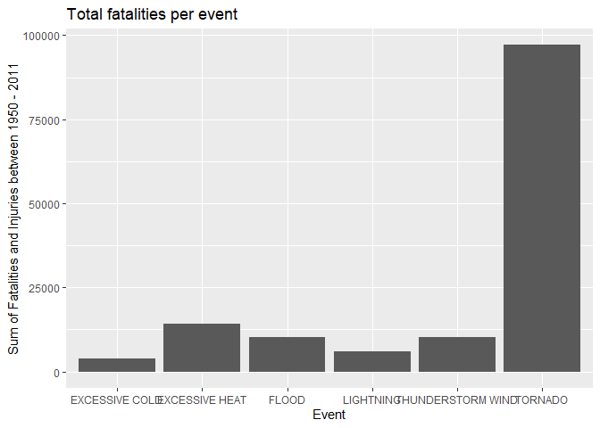
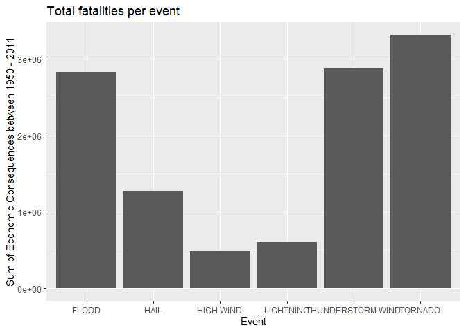

`Course Project 2` Reproducible Research
================

-   👨🏻‍💻 Author: Anderson H Uyekita
-   📚 Specialization: <a
    href="https://www.coursera.org/specializations/data-science-foundations-r"
    target="_blank" rel="noopener">Data Science: Foundations using R
    Specialization</a>
-   📖 Course:
    <a href="https://www.coursera.org/learn/reproducible-research"
    target="_blank" rel="noopener">Reproducible Research</a>
    -   🧑‍🏫 Instructor: Roger D Peng
-   📆 Week 4
    -   🚦 Start: Friday, 24 June 2022
    -   🏁 Finish: Friday, 24 June 2022

[](https://mybinder.org/v2/gh/AndersonUyekita/reproducible-research_course-project-2/master?urlpath=rstudio)

------------------------------------------------------------------------

## Impact of Weather Events on Public Health and Economics

### Sinopsis

Course Project 2 explore the storm database from [U.S. National Oceanic
and Atmospheric Administration’s (NOAA)](http://www.noaa.gov), and aims
to develop a brief data analysis about Economics consequences due to
storm, hurricane, and similar and which kind of weather situations has
the worse consequence to the population; Population Health due to those
extreme weather situations and which disasters has the most impact in
the population health. As a results, we realized the tornado is the most
harmful and the flood has the greatest economic consequences to the
population.

------------------------------------------------------------------------

#### Requirements and Settings

Requirements necessary to reproduce this analysis:

## 1. Data Processing

From the [U.S. National Oceanic and Atmospheric Administration’s
(NOAA)](http://www.noaa.gov) storm database we obtained data of storms
and weather events in the United States, including when and where they
occur, as well as estimates of any fatalities, injuries, and property
damage. We obtained the files between the years [1950 and
2011](%5B2%5D).

### 1.1. Loading

``` r
# 1. Create a data directory
if(!base::file.exists("data")) {
    base::dir.create("data")
}

# 2. Download files and store it in data directory.
if(!base::file.exists("./data/repdata_data_StormData.csv.bz2")){
    utils::download.file(url = "https://d396qusza40orc.cloudfront.net/repdata%2Fdata%2FStormData.csv.bz2",
                         destfile = "./data/repdata_data_StormData.csv.bz2")
}
```

### 1.2. Data Processing (Reading data from 1950 to 2011)

First of all, we read the data from the raw `.csv` file included in the
`bz2` archive. The data is a regular delimited file were fileds are
delimited with dot comma and missing values are coded as blank fields.

``` r
raw_data <- read.csv(file = "./data/repdata_data_StormData.csv.bz2")

# Convert the regular data frame into a dplyr table
tbl_raw_data <- tbl_df(raw_data)
```

After reading the bz2 file, the raw data has 902297 observations and 37
column (variables), as can be seen by the dim() function.

``` r
dim(tbl_raw_data)
```

    ## [1] 902297     37

The first 6 lines of the raw data set:

``` r
head(tbl_raw_data,6)
```

    ## # A tibble: 6 x 37
    ##   STATE__ BGN_DATE   BGN_TIME TIME_ZONE COUNTY COUNTYNAME STATE EVTYPE BGN_RANGE
    ##     <dbl> <chr>      <chr>    <chr>      <dbl> <chr>      <chr> <chr>      <dbl>
    ## 1       1 4/18/1950~ 0130     CST           97 MOBILE     AL    TORNA~         0
    ## 2       1 4/18/1950~ 0145     CST            3 BALDWIN    AL    TORNA~         0
    ## 3       1 2/20/1951~ 1600     CST           57 FAYETTE    AL    TORNA~         0
    ## 4       1 6/8/1951 ~ 0900     CST           89 MADISON    AL    TORNA~         0
    ## 5       1 11/15/195~ 1500     CST           43 CULLMAN    AL    TORNA~         0
    ## 6       1 11/15/195~ 2000     CST           77 LAUDERDALE AL    TORNA~         0
    ## # ... with 28 more variables: BGN_AZI <chr>, BGN_LOCATI <chr>, END_DATE <chr>,
    ## #   END_TIME <chr>, COUNTY_END <dbl>, COUNTYENDN <lgl>, END_RANGE <dbl>,
    ## #   END_AZI <chr>, END_LOCATI <chr>, LENGTH <dbl>, WIDTH <dbl>, F <int>,
    ## #   MAG <dbl>, FATALITIES <dbl>, INJURIES <dbl>, PROPDMG <dbl>,
    ## #   PROPDMGEXP <chr>, CROPDMG <dbl>, CROPDMGEXP <chr>, WFO <chr>,
    ## #   STATEOFFIC <chr>, ZONENAMES <chr>, LATITUDE <dbl>, LONGITUDE <dbl>,
    ## #   LATITUDE_E <dbl>, LONGITUDE_ <dbl>, REMARKS <chr>, REFNUM <dbl>

The last 6 lines of the raw data set:

``` r
tail(tbl_raw_data,6)
```

    ## # A tibble: 6 x 37
    ##   STATE__ BGN_DATE   BGN_TIME TIME_ZONE COUNTY COUNTYNAME STATE EVTYPE BGN_RANGE
    ##     <dbl> <chr>      <chr>    <chr>      <dbl> <chr>      <chr> <chr>      <dbl>
    ## 1      47 11/28/201~ 03:00:0~ CST           21 TNZ001>00~ TN    WINTE~         0
    ## 2      56 11/30/201~ 10:30:0~ MST            7 WYZ007 - ~ WY    HIGH ~         0
    ## 3      30 11/10/201~ 02:48:0~ MST            9 MTZ009 - ~ MT    HIGH ~         0
    ## 4       2 11/8/2011~ 02:58:0~ AKS          213 AKZ213     AK    HIGH ~         0
    ## 5       2 11/9/2011~ 10:21:0~ AKS          202 AKZ202     AK    BLIZZ~         0
    ## 6       1 11/28/201~ 08:00:0~ CST            6 ALZ006     AL    HEAVY~         0
    ## # ... with 28 more variables: BGN_AZI <chr>, BGN_LOCATI <chr>, END_DATE <chr>,
    ## #   END_TIME <chr>, COUNTY_END <dbl>, COUNTYENDN <lgl>, END_RANGE <dbl>,
    ## #   END_AZI <chr>, END_LOCATI <chr>, LENGTH <dbl>, WIDTH <dbl>, F <int>,
    ## #   MAG <dbl>, FATALITIES <dbl>, INJURIES <dbl>, PROPDMG <dbl>,
    ## #   PROPDMGEXP <chr>, CROPDMG <dbl>, CROPDMGEXP <chr>, WFO <chr>,
    ## #   STATEOFFIC <chr>, ZONENAMES <chr>, LATITUDE <dbl>, LONGITUDE <dbl>,
    ## #   LATITUDE_E <dbl>, LONGITUDE_ <dbl>, REMARKS <chr>, REFNUM <dbl>

### Questions

1.  Across the United States, which types of events (as indicated in the
    EVTYPE variable) are most harmful with respect to population health?
2.  Across the United States, which types of events have the greatest
    economic consequences?

### Subsetting the raw data

This step is necessary to turn the study faster due to the large amount
of informations on the raw data. The subset aim to gather only the data
necessary to make the desired analysis. Thus, will be select the
columns: EVTYPE, INJURIES, FATALITIES, PROPDMG, CROPDMG, PROPDMGEXP, and
CROPDMGEXP.

``` r
dataset <- select(tbl_raw_data,EVTYPE,INJURIES,FATALITIES,PROPDMG,PROPDMGEXP,CROPDMG,CROPDMGEXP)
```

There are a weird notation to PROPDMG and CROPDMG. Each one need one
more column to represent the information of losses (PROPDMGEXP and
CROPDMGEXP). The index `H` represent Hundreds, `K` represent Thousand,
`M` represent Millions and `B` represent Billions. Thus, those
information will be aggregate into one column.

``` r
# The PROPDMGEXP is case sensitive.
dataset <- mutate(dataset,PROPDMGEXP_num = 0 )
dataset <- mutate(dataset,PROPDMGEXP_num = ifelse(test = ((PROPDMGEXP == "H") | (PROPDMGEXP == "h")), yes = 100, no = PROPDMGEXP_num ) )
dataset <- mutate(dataset,PROPDMGEXP_num = ifelse(test = ((PROPDMGEXP == "K") | (PROPDMGEXP == "k")), yes = 1000, no = PROPDMGEXP_num ) )
dataset <- mutate(dataset,PROPDMGEXP_num = ifelse(test = ((PROPDMGEXP == "M") | (PROPDMGEXP == "m")), yes = 1000000, no = PROPDMGEXP_num ) )
dataset <- mutate(dataset,PROPDMGEXP_num = ifelse(test = ((PROPDMGEXP == "B") | (PROPDMGEXP == "b")), yes = 1000000000, no = PROPDMGEXP_num ) )

# Substitution the incomplete information with the compounding of those two column (PROPDMGEXP and PROPDMG).
dataset <- mutate(dataset,PROPDMG = PROPDMGEXP_num*PROPDMG)

# The CROPDMGEXP is case sensitive.
dataset <- mutate(dataset,CROPDMGEXP_num = 0 )
dataset <- mutate(dataset,CROPDMGEXP_num = ifelse(test = ((CROPDMGEXP == "H") | (CROPDMGEXP == "h")), yes = 100, no = CROPDMGEXP_num ) )
dataset <- mutate(dataset,CROPDMGEXP_num = ifelse(test = ((CROPDMGEXP == "K") | (CROPDMGEXP == "k")), yes = 1000, no = CROPDMGEXP_num ) )
dataset <- mutate(dataset,CROPDMGEXP_num = ifelse(test = ((CROPDMGEXP == "M") | (CROPDMGEXP == "m")), yes = 1000000, no = CROPDMGEXP_num ) )
dataset <- mutate(dataset,CROPDMGEXP_num = ifelse(test = ((CROPDMGEXP == "B") | (CROPDMGEXP == "b")), yes = 1000000000, no = CROPDMGEXP_num ) )

# Substitution the incomplete information with the compounding of those two column (CROPDMGEXP and CROPDMG).
dataset <- mutate(dataset,CROPDMG = CROPDMGEXP_num*CROPDMG)

# Subsetting the dataset to show only the necessary column.
tidy_dataset <- select(dataset,EVTYPE,INJURIES,FATALITIES,PROPDMG,CROPDMG)
```

### Results

#### Question 1

-   Across the United States, which types of events (as indicated in the
    EVTYPE variable) are most harmful with respect to population health?

*Answer*

First of all, we need to aggregate `INJURIES` and `FATALITIES` to help
us to discern which `EVTYPE` is the most harmful to the population
health.

``` r
# Function aggregate() used to compounding variables.
EVTYPE_harmful <- aggregate( cbind(INJURIES,FATALITIES,INJURIES+FATALITIES) ~ EVTYPE, data = tidy_dataset, FUN = sum)

# Renaming column to keep the dataset organized.
colnames(EVTYPE_harmful) <- c('EVTYPE','INJURIES','FATALITIES','INJURIES_FATALITIES')
```

Assuming a proper register of `EVTYPES` without any typos and any other
problem. The most harmful is the TORNADO with 91346 injuries and 5633
fatalities over the dataset period. The table bellow shows the first 6
harmful `EVTYPES`.

``` r
attach(EVTYPE_harmful)
head(EVTYPE_harmful[order(-INJURIES_FATALITIES),],6)
```

    ##             EVTYPE INJURIES FATALITIES INJURIES_FATALITIES
    ## 834        TORNADO    91346       5633               96979
    ## 130 EXCESSIVE HEAT     6525       1903                8428
    ## 856      TSTM WIND     6957        504                7461
    ## 170          FLOOD     6789        470                7259
    ## 464      LIGHTNING     5230        816                6046
    ## 275           HEAT     2100        937                3037

Graphically, the most harmful `EVTYPES`.

``` r
# Subset of first 6 most harmful EVTYPES
bar_plot <- head(EVTYPE_harmful[order(-INJURIES_FATALITIES),],6)

# Barplot using ggplot package
ggplot(bar_plot,aes(x = EVTYPE,y = INJURIES_FATALITIES,group = 1))+
geom_bar(stat = "identity")+
ylab("Sum of Fatalities and Injuries between 1950 - 2011") +
xlab("Event") +
ggtitle ("Total fatalities per event")
```

<!-- -->

#### Question 2

2.  Across the United States, which types of events have the greatest
    economic consequences?

*Answer*

First of all, we need to aggregate `PROPDMG` and `CROPDMG` to help us to
discern which `EVTYPE` has the the greatest economic consequences.

``` r
# Function aggregate() used to compounding variables.
EVTYPE_DMG <- aggregate( cbind(PROPDMG,CROPDMG,PROPDMG + CROPDMG) ~ EVTYPE, data = dataset, FUN = sum)

# Renaming column to keep the dataset organized.
colnames(EVTYPE_DMG) <- c('EVTYPE','PROPDMG','CROPDMG','PROPDMG_CROPDMG')
```

Assuming a proper register of `EVTYPES` without any typos and any other
problem. The `EVTYPES` that has the the greatest economic consequences
is the `FLOOD` with 150,319,678,250 of dollars over the dataset period.
The table bellow shows the results of others `EVTYPES`.

``` r
attach(EVTYPE_DMG)
head(EVTYPE_DMG[order(-PROPDMG_CROPDMG),],6)
```

    ##                EVTYPE      PROPDMG    CROPDMG PROPDMG_CROPDMG
    ## 170             FLOOD 144657709800 5661968450    150319678250
    ## 411 HURRICANE/TYPHOON  69305840000 2607872800     71913712800
    ## 834           TORNADO  56937160480  414953110     57352113590
    ## 670       STORM SURGE  43323536000       5000     43323541000
    ## 244              HAIL  15732267220 3025954450     18758221670
    ## 153       FLASH FLOOD  16140811510 1421317100     17562128610

Graphically, the `EVTYPES` with the the greatest economic consequences.

``` r
# Subset of first 6 most harmful EVTYPES
bar_plot2 <- head(EVTYPE_DMG[order(-PROPDMG_CROPDMG),],6)

# Barplot using ggplot package
ggplot(bar_plot2,aes(x = EVTYPE,y = PROPDMG_CROPDMG,group = 1))+
geom_bar(stat = "identity")+
ylab("Sum of Economic Consequences between 1950 - 2011") +
xlab("Event") +
ggtitle ("Total fatalities per event")
```

<!-- -->
